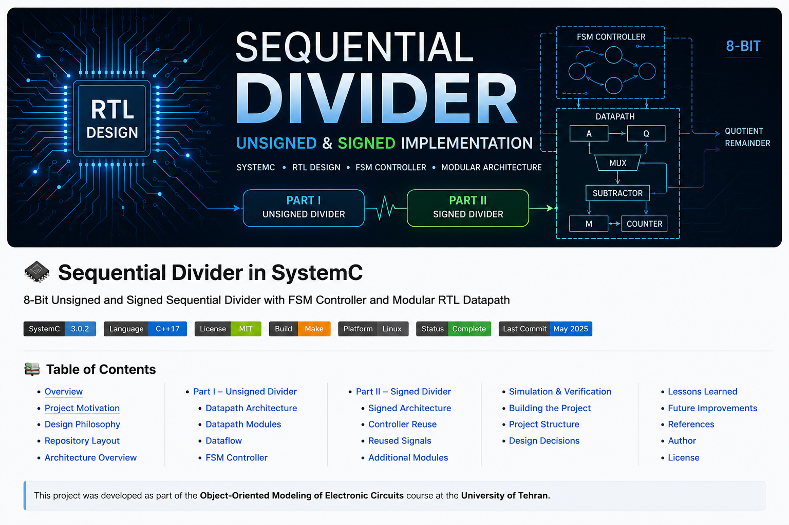
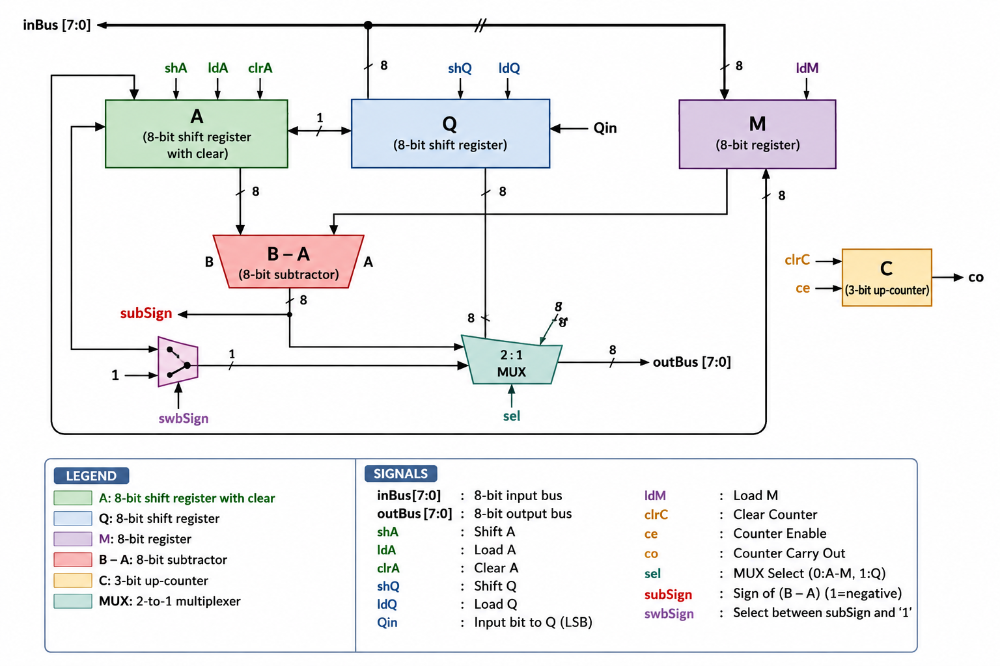
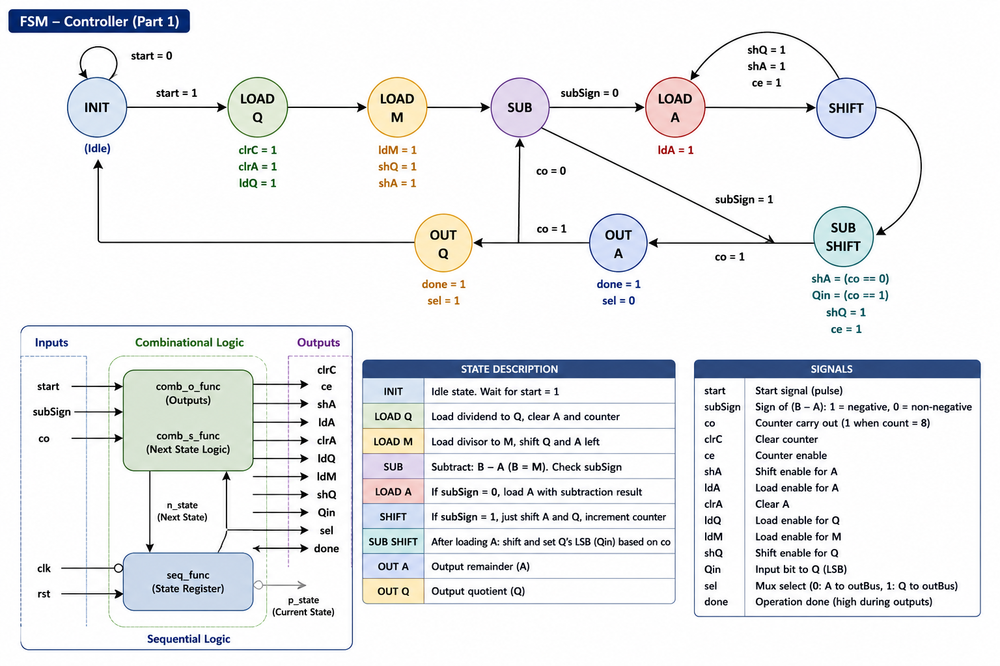
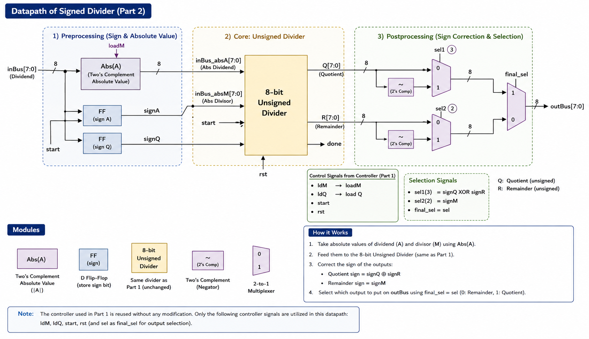

<!-- ========================================================= -->
<!--                       PROJECT HEADER                       -->
<!-- ========================================================= -->

<p align="center">
  
</p>

# SystemC Sequential Divider
### RTL Modeling of an 8-bit Sequential Divider with SystemC

<p align="center">


</p>

<p align="center">

An RTL implementation of **Unsigned** and **Signed Sequential Division**
using **SystemC**, featuring a modular **Datapath/Controller architecture**,
FSM-based control logic, reusable RTL components, and waveform-driven verification.

</p>

## Overview

This repository presents a **Register Transfer Level (RTL)** implementation of an **8-bit Sequential Divider** using **SystemC**, developed as part of the **Object-Oriented Modeling of Electronic Circuits** course at the **University of Tehran**.

Unlike software-oriented C++ projects, this repository models digital hardware components at the RTL level using object-oriented design principles. The implementation follows a modular architecture that separates the **datapath** from the **control unit**, allowing each hardware block to be developed, verified, and maintained independently.

The project consists of two major stages:

- **Part I:** Design and implementation of an unsigned sequential divider.
- **Part II:** Extension of the original design to support signed division through a dedicated bus interface while preserving the original divider implementation.

The complete design is verified using dedicated **SystemC testbenches**, and simulation results can be inspected through generated **VCD waveform files**.

---

# Project Highlights

- RTL implementation using **SystemC**
- Modular **Datapath / Controller** architecture
- Finite State Machine (FSM) based controller
- 8-bit Sequential Unsigned Divider
- Signed Divider implemented through an external Bus Interface
- Reuse of the original controller without modification
- Independent simulation environments for both implementations
- Waveform generation for timing verification
- Modular hardware components for improved maintainability

---

# Project Motivation

Sequential arithmetic units remain fundamental building blocks in digital systems, embedded processors, and computer architecture. Implementing such circuits at the RTL level provides valuable insight into how arithmetic operations are translated into hardware through registers, combinational logic, control units, and timing synchronization.

This project aims to bridge the gap between software engineering concepts and digital hardware design by demonstrating how **SystemC** can be used as an object-oriented hardware description language to model, simulate, and verify RTL circuits.

Rather than focusing solely on obtaining a functional divider, the project emphasizes:

- modular hardware design,
- clear separation of control and datapath,
- component reusability,
- simulation-driven verification,
- and scalable RTL architecture.

---

# Design Philosophy

The implementation follows one of the most widely adopted RTL design methodologies: **separation of the datapath and controller**.

Instead of embedding control logic directly into arithmetic components, the design is partitioned into independent hardware modules with clearly defined responsibilities.

This architecture provides several advantages:

- Improved readability of the hardware design
- Easier debugging and verification
- Independent testing of datapath and controller
- Better scalability for future extensions
- Higher component reusability

A key demonstration of this philosophy appears in **Part II**, where signed division is implemented **without modifying the original unsigned divider controller**. Instead, the signed divider extends the existing architecture by introducing an external datapath interface that reuses the controller and divider as reusable hardware blocks.

This modular organization closely resembles industrial RTL development practices used in FPGA and ASIC design flows.

---

# Repository Layout

```text
.
├── docs/
|   ├── images/
|   │   ├── banner.png
|   │   ├── controller.png
|   │   ├── signed_divider_datapath.png
|   │   └── unsigned_divider_datapath.png
|   └── report.pdf
│
├── unsigned_divider/
│
├── signed_divider/
│
├── README.md
└── LICENSE
```

The repository is organized into two independent implementations:

- **unsigned_divider/** contains the complete RTL implementation of the unsigned sequential divider together with its controller, datapath, testbench, simulation files, and build configuration.

- **signed_divider/** extends the original design by surrounding the unsigned divider with additional interface logic responsible for handling signed arithmetic.

Supporting documentation, architecture diagrams, and the project report are available inside the **docs/** directory.

---

# Architecture Overview

The project is organized around a **hierarchical RTL architecture**, where each functional unit is implemented as an independent hardware module. This modular organization improves readability, enables isolated verification of individual components, and simplifies future extensions.

At the highest level, the repository contains two complete divider implementations:

- **Unsigned Sequential Divider**
- **Signed Sequential Divider**

The unsigned divider serves as the core arithmetic engine, while the signed divider extends its functionality through an additional interface layer without modifying the original RTL implementation.

The following diagram summarizes the overall project organization.

```text
                        +----------------------+
                        |      Testbench       |
                        +----------+-----------+
                                   |
                                   |
                      +------------v-------------+
                      |      Divider Module      |
                      +------------+-------------+
                                   |
                 +-----------------+-----------------+
                 |                                   |
                 |                                   |
        +--------v--------+                +---------v---------+
        |   Controller    |                |     Datapath      |
        |      (FSM)      |<-------------->| RTL Components    |
        +--------+--------+                +---------+---------+
                 |                                   |
                 |                                   |
                 +-----------------+-----------------+
                                   |
                                   |
                         Quotient / Remainder
```

The controller is responsible for generating all control signals required by the datapath, while the datapath performs arithmetic operations, register transfers, shifting operations, and iteration counting.

This strict separation between **control logic** and **data processing** is a classical RTL design methodology widely adopted in FPGA and ASIC development.

---

# Hardware Design Flow

The development process follows the traditional RTL design flow.

```text
Algorithm Specification
          │
          ▼
RTL Architecture
          │
          ▼
Datapath Design
          │
          ▼
FSM Controller Design
          │
          ▼
SystemC Implementation
          │
          ▼
Testbench Development
          │
          ▼
Simulation
          │
          ▼
Waveform Verification
```

Each stage was verified independently before integrating the complete divider.

---

# Part I — Unsigned Sequential Divider

The first part of the project implements an **8-bit sequential unsigned divider** based on the classical restoring division algorithm.

Rather than describing the divider as a single monolithic circuit, the implementation separates the design into two independent RTL blocks:

- **Datapath**
- **Controller**

This separation significantly simplifies debugging and verification while making the overall architecture considerably more maintainable.

The datapath contains all arithmetic and storage elements, whereas the controller orchestrates every operation through a finite state machine.

---

# Unsigned Divider Datapath

<p align="center">

</p>

The datapath is responsible for executing every arithmetic operation required during the division process.

Its primary responsibilities include:

- Loading the dividend and divisor
- Maintaining the partial remainder
- Performing subtraction
- Executing left-shift operations
- Updating the quotient
- Counting completed iterations
- Selecting the final output

The design is entirely modular, with each hardware component implemented as an independent SystemC module.

---

## Datapath Components

| Module | Description |
|---------|-------------|
| **Register A** | Stores the partial remainder and supports synchronous clear and shift operations. |
| **Register Q** | Holds the dividend during initialization and gradually becomes the quotient throughout the division process. |
| **Register M** | Stores the divisor value throughout the computation. |
| **Subtractor** | Computes the intermediate subtraction (`A − M`) used by the controller decision logic. |
| **Shift Registers** | Perform left-shift operations required by the sequential division algorithm. |
| **Multiplexer** | Selects whether the output bus presents the quotient or the remainder. |
| **Iteration Counter** | Tracks completed division cycles and determines when the algorithm finishes. |

Each module is implemented independently, allowing isolated testing and easier reuse in future hardware projects.

---

# Dataflow Description

The unsigned divider executes the restoring division algorithm through a sequence of register transfers coordinated by the controller.

The overall dataflow can be summarized as follows:

```text
Dividend
    │
    ▼
 Register Q
    │
    │ Shift Left
    ▼
 Register A
    │
    ▼
 Subtractor
    │
    ▼
Controller Decision
    │
 ┌──┴─────────────┐
 │                │
 ▼                ▼
Load A        Restore A
 │                │
 └──────┬─────────┘
        ▼
 Update Q
        │
        ▼
 Counter++
        │
        ▼
 Done ?
```

The controller continuously observes the subtraction result and iteration counter to determine the next state of the division process.

---

# Finite State Machine (FSM) Controller

The control unit is implemented as a **Finite State Machine (FSM)** responsible for coordinating all operations performed by the datapath.

Rather than embedding decision logic inside arithmetic modules, the controller generates a dedicated set of control signals that determine:

- Register initialization
- Shift operations
- Register loading
- Arithmetic execution
- Counter management
- Output selection
- Completion detection

This separation of concerns allows the datapath to remain purely computational while all sequencing logic is concentrated inside the FSM.

---

## Controller Architecture

<p align="center">

</p>

The controller continuously monitors the status of the datapath and determines which operation should be executed during the next clock cycle.

The state transitions depend primarily on:

- Start signal
- Counter completion
- Subtractor sign bit
- Current controller state

The implementation follows a synchronous Moore/Mealy hybrid architecture in which state transitions occur on the rising edge of the clock, while several output signals are generated combinationally.

---

# Controller Responsibilities

The FSM performs the following tasks throughout the division process:

- Initialize all registers
- Load the dividend
- Load the divisor
- Clear the remainder register
- Shift the register pair
- Evaluate subtraction results
- Update quotient bits
- Increment the iteration counter
- Detect completion
- Select quotient or remainder as output

No arithmetic computation is performed inside the controller itself.

Instead, the controller only orchestrates the datapath by generating appropriate control signals.

---

# FSM States

The implemented controller consists of the following RTL states:

| State | Responsibility |
|--------|----------------|
| **INIT** | Waits for the `start` signal and initializes the divider. |
| **LOAD_Q** | Loads the dividend into Register Q and clears Register A and the iteration counter. |
| **LOAD_M** | Loads the divisor into Register M. |
| **SUB** | Evaluates the subtraction result (`A − M`). |
| **LOAD_A** | Stores the subtraction result into Register A when the subtraction is non-negative. |
| **SHIFT** | Performs left-shift operations and advances the iteration counter. |
| **SUB_SHIFT** | Handles the combined subtraction and shifting sequence near the end of the algorithm. |
| **OUT_A** | Selects the remainder as the output. |
| **OUT_Q** | Selects the quotient as the output and completes the operation. |

Each state has a clearly defined hardware responsibility, resulting in a controller that is easy to debug and extend.

---

# Controller Inputs

The controller receives status information from the datapath through the following signals.

| Signal | Description |
|---------|-------------|
| `clk` | System clock |
| `rst` | Synchronous reset |
| `start` | Begins a new division operation |
| `co` | Counter overflow indicating completion of all iterations |
| `subSign` | Sign bit of the subtraction result |

These signals completely determine the controller's state transitions.

---

# Generated Control Signals

The controller generates all datapath control signals required for sequential division.

| Signal | Function |
|---------|----------|
| `clrA` | Clears Register A |
| `clrC` | Clears the iteration counter |
| `ldQ` | Loads Register Q |
| `ldM` | Loads Register M |
| `ldA` | Loads Register A |
| `shA` | Enables shifting of Register A |
| `shQ` | Enables shifting of Register Q |
| `Qin` | Provides the serial input bit for Register Q |
| `ce` | Enables the iteration counter |
| `sel` | Selects the output bus (Quotient / Remainder) |
| `done` | Indicates completion of the division process |

Because every datapath operation is controlled exclusively through these signals, the arithmetic modules remain completely independent from the sequencing logic.

---

# Controller–Datapath Interaction

The controller and datapath communicate exclusively through well-defined RTL signals.

```text
                Controller (FSM)

        +--------------------------+
        |                          |
        |  ldA   ldQ   ldM          |
        |  shA   shQ   Qin          |
        |  clrA  clrC  ce           |
        |  sel   done               |
        +------------+--------------+
                     |
                     |
                     ▼
               Datapath Modules

    Registers • Counter • MUX • Subtractor

                     ▲
                     |
                     |
             co, subSign
```

This bidirectional communication provides a clean separation between control logic and arithmetic computation, which is a standard RTL design methodology used in modern digital systems.

---

# Design Advantages

The adopted controller architecture provides several practical benefits.

- Modular RTL implementation
- Independent controller verification
- Independent datapath verification
- Improved readability
- Easier debugging
- Hardware reusability
- Clear separation between sequencing and computation
- Straightforward future extensions

The modular nature of the controller becomes particularly important in **Part II**, where the exact same controller is reused without introducing any additional states or modifying its internal logic.

This demonstrates one of the primary goals of RTL design: **hardware reuse through modular architecture**.

---

# Part II — Signed Sequential Divider

While the first part of the project implements an **8-bit unsigned sequential divider**, modern processors and digital systems must also support arithmetic operations on signed integers.

Instead of redesigning the divider from scratch, the second part extends the original architecture by introducing a dedicated **bus interface** around the existing unsigned divider.

This approach preserves the original RTL implementation while adding support for signed arithmetic through preprocessing and postprocessing stages.

The resulting architecture follows one of the most important principles in hardware design:

> **Reuse existing verified hardware whenever possible instead of redesigning it.**

---

# Design Objectives

The signed divider was designed under the following constraints:

- Preserve the original unsigned divider.
- Do not modify the original controller.
- Do not modify the original datapath.
- Support signed operands.
- Keep the design modular.
- Reuse previously verified RTL modules.
- Maintain compatibility with the existing testbench methodology.

These constraints encouraged a reusable hardware architecture instead of duplicating or rewriting the divider implementation.

---

# Signed Divider Architecture

<p align="center">

</p>

The signed divider is implemented as a wrapper around the original unsigned divider.

Rather than changing the internal divider logic, several additional RTL components are introduced before and after the divider.

These components are responsible for:

- Operand preprocessing
- Sign detection
- Absolute value generation
- Quotient correction
- Remainder correction
- Final output selection

The unsigned divider therefore remains the computational core of the complete system.

---

# Hardware Organization

The architecture can be divided into three logical stages.

```text
Signed Inputs
      │
      ▼
+---------------------------+
| Operand Preprocessing     |
|                           |
| • Sign Detection          |
| • Absolute Value          |
| • Sign Registers          |
+-------------+-------------+
              │
              ▼
+---------------------------+
| Unsigned Divider          |
| (Reused without changes)  |
+-------------+-------------+
              │
              ▼
+---------------------------+
| Result Postprocessing     |
|                           |
| • Quotient Correction     |
| • Remainder Correction    |
| • Output Selection        |
+-------------+-------------+
              │
              ▼
      Final Signed Output
```

This layered organization allows each stage to focus on a single responsibility while preserving the modularity of the complete RTL design.

---

# Operand Preprocessing

Before performing the division, both operands are analyzed.

If an operand is negative, its absolute value is generated using a dedicated hardware module.

The original sign information is stored inside dedicated flip-flops for later use during the output correction stage.

This preprocessing stage allows the unsigned divider to operate exclusively on positive values.

---

# Absolute Value Generator

The project includes a dedicated **Two's Complement Absolute Value** module.

Its responsibilities are:

- Detect negative operands.
- Generate their absolute value.
- Forward positive operands unchanged.

Because this functionality is isolated inside a separate module, the divider itself remains completely unaware of operand signs.

---

# Sign Registers

The sign of each operand is preserved using dedicated D Flip-Flops.

The stored information is later used to determine:

- Final quotient sign
- Final remainder sign

This approach avoids repeated sign computations throughout the division process.

---

# Output Postprocessing

Once the unsigned divider completes the division, additional hardware determines the correct signed result.

Depending on the stored operand signs, the interface performs:

- Quotient negation
- Remainder correction
- Output multiplexing

All sign-related computations are performed outside the divider itself.

---

# Controller Reuse

One of the primary design goals of this project was to demonstrate **hardware reusability**.

Unlike many implementations that introduce a completely new controller for signed arithmetic, this project intentionally reuses the **exact same Finite State Machine (FSM)** developed for the unsigned divider.

No additional states were introduced.

No transitions were modified.

No timing behavior was changed.

The original controller is instantiated without altering its implementation.

Instead, the surrounding interface observes and reuses the controller outputs to coordinate the additional hardware modules.

This design decision significantly reduces implementation complexity while increasing maintainability and reliability.

---

# Reused Controller Signals

The following controller signals are directly reused by the signed divider interface.

| Controller Signal | Purpose in Part II |
|-------------------|--------------------|
| `start` | Starts the complete signed division operation. |
| `rst` | Resets the complete hardware system. |
| `ldQ` | Indicates when the dividend should be captured. |
| `ldM` | Indicates when the divisor should be captured. |
| `sel` | Determines whether the divider is currently outputting the quotient or the remainder and is reused for the final output multiplexer. |

These signals are sufficient to synchronize the additional interface logic with the original divider.

No extra control unit is required.

---

# Why Reusing the Controller Matters

Keeping the original controller unchanged provides several engineering advantages.

- The controller was already verified during Part I.
- No additional verification effort is required for new FSM logic.
- The datapath extension remains completely modular.
- Existing timing behavior is preserved.
- Hardware maintenance becomes easier.
- Future arithmetic extensions can reuse the same control logic.

This demonstrates a common industrial RTL development strategy:

> **Extend verified hardware through interface logic instead of modifying validated control logic.**

---

# Additional Hardware Modules

The signed divider introduces several new RTL components around the original divider.

| Module | Responsibility |
|---------|----------------|
| Two's Complement Absolute Value | Converts negative operands into their absolute values. |
| D Flip-Flops | Store operand signs. |
| Adder | Supports quotient correction. |
| Negator | Generates negative values when required. |
| Subtractor | Computes the corrected remainder. |
| Multiplexers | Select intermediate and final outputs. |

Each module performs a single dedicated task, following the same modular philosophy adopted throughout the project.

---

# Design Comparison

| Feature | Unsigned Divider | Signed Divider |
|----------|------------------|----------------|
| Datapath | ✔ | Extended |
| Controller | ✔ | **Exactly Reused** |
| FSM | ✔ | **Unmodified** |
| Bus Interface | ✖ | ✔ |
| Sign Handling | ✖ | ✔ |
| Quotient Correction | ✖ | ✔ |
| Remainder Correction | ✖ | ✔ |

The signed divider therefore represents an architectural extension rather than a redesign of the original system.

---

# Simulation & Verification

A digital hardware design is only as reliable as its verification methodology. Therefore, both implementations in this repository are accompanied by dedicated **SystemC testbenches** that validate the functional correctness of the divider throughout the complete execution flow.

Each divider is simulated independently, allowing the behavior of individual hardware modules to be verified before integration into the complete system.

---

# Verification Strategy

The verification process follows a hierarchical approach.

```text
Individual RTL Modules
          │
          ▼
 Datapath Verification
          │
          ▼
 Controller Verification
          │
          ▼
 Divider Integration
          │
          ▼
 Functional Testbench
          │
          ▼
 Waveform Inspection
```

Rather than validating only the final output, the internal behavior of registers, arithmetic units, control signals, and state transitions is observed throughout the simulation.

This approach makes debugging considerably easier while providing confidence in the correctness of the RTL implementation.

---

# Testbenches

Each divider implementation includes its own dedicated SystemC testbench.

| Testbench | Purpose |
|------------|---------|
| `dividerTB.cpp` | Verifies the functionality of the unsigned sequential divider. |
| `dividerSignedTB.cpp` | Verifies the complete signed divider architecture. |

The testbenches are responsible for:

- Initializing the simulation environment.
- Applying input stimuli.
- Generating clock signals.
- Monitoring outputs.
- Controlling reset and start sequences.
- Producing waveform files.

---

# Generated Waveforms

Simulation automatically generates **Value Change Dump (VCD)** files that capture every relevant hardware signal during execution.

| File | Description |
|------|-------------|
| `Divider_test.vcd` | Waveforms generated for the unsigned divider. |
| `DividerSigned_test.vcd` | Waveforms generated for the signed divider. |

These files can be inspected using **GTKWave** to analyze:

- Register contents
- FSM state transitions
- Shift operations
- Arithmetic results
- Counter behavior
- Output timing

Waveform inspection provides an additional level of confidence beyond observing only the final numerical result.

---

# Example Verification Flow

The complete verification sequence is summarized below.

```text
Compile Project
        │
        ▼
Run Simulation
        │
        ▼
Generate VCD
        │
        ▼
Open GTKWave
        │
        ▼
Inspect Registers
        │
        ▼
Inspect FSM
        │
        ▼
Verify Outputs
```

This workflow mirrors the standard verification process commonly used in RTL-based FPGA and ASIC development.

---

# Validation Goals

The simulation environment verifies several key properties of the divider implementation.

✔ Correct register initialization

✔ Proper FSM sequencing

✔ Correct shift operations

✔ Arithmetic correctness

✔ Quotient generation

✔ Remainder generation

✔ Counter termination

✔ Signed arithmetic support

✔ Final output selection

The verification process confirms that both divider implementations operate according to their intended RTL behavior.

---

# Development Environment

The project was developed and tested using the following software environment.

| Component | Version |
|----------|---------|
| Operating System | Ubuntu 24.04.3 LTS |
| Language | C++17 |
| Compiler | GCC 14.2.0 |
| Framework | SystemC 3.0.2 |
| Build System | GNU Make |

The SystemC installation directory is expected to be:

```text
/opt/systemc
```

The provided Makefiles are configured accordingly.

---

# Building the Project

Each implementation can be compiled independently.

## Build the Unsigned Divider

```bash
cd unsigned_divider

make

./divider_sim.out
```

---

## Build the Signed Divider

```bash
cd signed_divider

make

./dividerSigned_sim.out
```

Both implementations generate VCD waveform files during simulation that can be inspected using GTKWave.

---

# Project Structure

```text
.
├── docs/
|   ├── images/
|   │   ├── banner.png
|   │   ├── controller.png
|   │   ├── signed_divider_datapath.png
|   │   └── unsigned_divider_datapath.png
|   └── report.pdf
│
├── unsigned_divider
│   ├── dividerController.*
│   ├── dividerDatapath.*
│   ├── divider.*
│   ├── dividerTB.*
│   ├── register.*
│   ├── shiftRegister.*
│   ├── shiftRegisterClr.*
│   ├── subtractor.*
│   ├── mux.*
│   ├── upCounter.*
│   ├── Makefile
│   └── main.cpp
│
├── signed_divider
│   ├── dividerSigned.*
│   ├── dividerSignedTB.*
│   ├── adder.h
│   ├── negator.h
│   ├── twosComplementAbs.h
│   ├── dff.h
│   ├── mux_p2.h
│   ├── subtractor_p2.h
│   ├── unsigned_divider/
│   ├── Makefile
│   └── main.cpp
│
├── LICENSE
└── README.md
```

---

# Design Decisions

Several architectural decisions were intentionally made during the implementation of this project.

### Separation of Datapath and Controller

The arithmetic units and sequencing logic are implemented independently, following classical RTL design principles.

### Modular Hardware Components

Registers, multiplexers, subtractors, counters, and arithmetic units are implemented as standalone SystemC modules to maximize readability and reusability.

### Controller Reuse

The signed divider extends the original architecture **without modifying the existing finite state machine**.

Instead, additional interface logic is introduced around the verified divider.

This design minimizes implementation effort while preserving correctness.

### Verification-Oriented Development

Every implementation includes its own dedicated testbench and waveform generation, enabling detailed functional verification of both the datapath and the controller.

---

# Lessons Learned

Developing this project provided practical experience in several aspects of digital hardware design.

- RTL-level hardware modeling using SystemC
- FSM-based controller implementation
- Modular digital system design
- Datapath and controller partitioning
- Register-transfer operations
- Hardware verification using simulation
- Waveform-based debugging
- Component reusability in RTL architectures
- Hardware/software abstraction using object-oriented programming

---

# Future Improvements

Several enhancements can be considered in future versions of the project.

- Parameterizable datapath width
- Generic template-based divider modules
- Support for non-restoring division
- Radix-4 sequential divider
- Pipelined divider architecture
- FPGA synthesis support
- Verilator compatibility
- Continuous Integration (GitHub Actions)
- Automatic regression testing
- Additional verification scenarios

---

# References

- IEEE SystemC Standard
- Accellera SystemC Documentation
- Object-Oriented Modeling of Electronic Circuits Course Materials
- Digital Design and Computer Architecture
  David Money Harris & Sarah Harris

---

# Author

**Ali Dehghani**

B.Sc. Student in Electrical and Computer Engineering

University of Tehran

Interested in:

- Computer Architecture
- Embedded Systems
- RTL Design
- Digital Hardware Design
- System Programming

---

# License

This project is released under the **MIT License**.

See the [LICENSE](LICENSE) file for more information.

---

# Acknowledgments

This project was developed as part of the **Object-Oriented Modeling of Electronic Circuits** course at the **University of Tehran**.

Special thanks to the course instructors for providing the design requirements and project specifications that motivated this implementation.